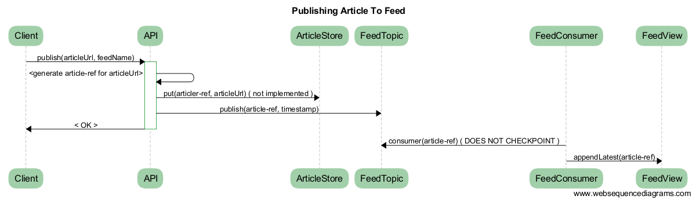
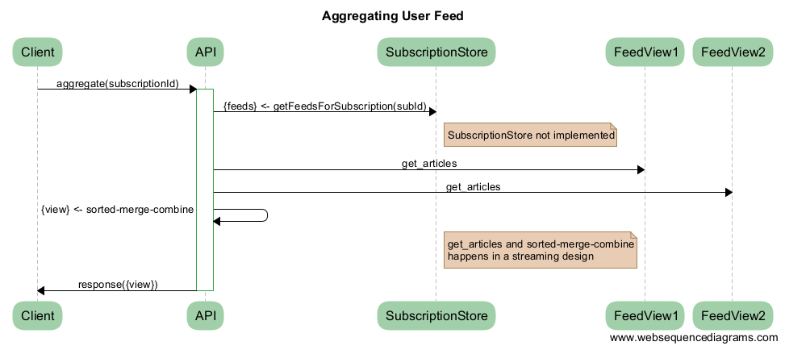

# Feeds Demo

# Design & Reasoning
## Characteresic of the system
* Article : is some content storing url and/or metadata related to some content. It can be stored directly using a key-value store. Each article has a ref ( possibly the hash or the url or some identifier )
* Feeds are stores of article-refs references in some chronological order. There are writes of these article-refs onto the feeds. We need some datastore to store these records on chronological order ( either by indexing or physical layout ) so that the read access pattern can be satisfied
* Subscriptions are sets of feed references. These sets can simply be stored in a key-value store and provide CRUD operations on these sets.
* User Aggregated Feed : this is the union of the articles in the feeds belonging to the subscribed feeds. This API is the crux of the system and defines the data-storage design choices etc.
* I/O Characterestics and Scaling
	* Number of feeds : Feeds are relatively independent. We need to write article-refs (fixed-size records) into the store and data is also read in the order. Since these are independent, they can also be hortizontally scaled by simple partitioning of different feeds on different nodes if needed.
	* Number of articles and subscription sets : are pure key-value type data-stores and highly scalable using partitioning by key. Also cache-able based on hot objects if needed.
	* User Aggregated Feeds : This is the read side of the system and affects the read I/O for article-refs from mulitple feeds and aggregating them at read time or possibly keep updating aggregated feeds at write time. This drives strong design choices.

## Design of Aggregating User Feeds
* Primarily there are two design choices : 
	* a. Aggregate user feeds at write time of an article. This creates huge write-amplifaction as this needs to be in the O(subscriptions which contain the feeds) and clearly not a poor choice. Also we do not know how may of these 'aggregated views' will acutally result in being requested.
	* b. clearly there is huge advantage if we can somehow quickly aggregate the limited view of the aggregated feed at read time. To do this we need to do the following at read time : 
		* Collect / Read all the article-refs from all the feeds of the subscriptions
		* Combine them and present them to the customer

### Data-Storage Design for Feeds and Aggregation
* So to design a data-store for the feed to store article-refs to satify high-read rate and and some moderate write-rate, and in the ordered sequence of article-refs, we have the following choices :
	* log-sequence structure of physical layout of records - doesnt require explicit indexes and writes and read can be fast exploiting sequential I/O
	* some other strucutre with ordered b-tree index. This is also possible as write-rate is considered not that high. But the log-sequence store is clearly more simple and what is also required.

* So for the choices of log-sequence store, 
	* I had a choice of using some key-value stores which store range keys in some order - here I could have used feed:timestamp. But during read time, it has to search for where this range is located in the table or shard.
	* or use a log-sequence store like Kafka. Here my design is to use Kafka to store the ordered sequence of article-refs for a feed. i.e each feed will be it's own 'topic'. When we read records of the sequence, we will NOT remove them ( i,e by committing ). We can always read any range. We will ocassionally checkpoint/commit of old article-refs as needed which are old and can be discarded based on use-case.
	* The additional component I added was that we need only the latest n records per feed to serve the user-feed aggregations in the most case. If we need to support older we can always read of the Kafka topic directly. So I made an in-memory sliding window of the latest n records and each feed will have a consumer which will keep this last-n cache updated when a new article is added into the system. If the systme restats records will always we present and we can build this cache. NOTE that the consumer will not checkpoint/commit i.e remove the records it has read, so it can be re-read when needed. older records can be commited of based on space and use-case.

### Aggregation API
* When a new article-ref comes in, it is added to the topic/feed (1:1). The consumer for the feed picks it up and updates the last-n window cache


* When the user requests his aggregated feed, the article-refs from the feed-caches are sorted-merge-combined to created an aggregated view of some size and returned back. Sizes of these last-n window caches can be configured to play for different requirements.



	
# To Execute
* Download single fat-jar [feeds.jar](https://www.dropbox.com/s/q21e8gul10ftoma/feeds.jar)
* Download the config file [feeds.yml](https://www.dropbox.com/s/x833knqpojkmunj/feeds.yml)
* Execute 
```
java -jar ./feeds.jar server ./feeds.yml
```
* http REST API 
	* available @ port 10991
	* /swagger shows UI to the APIs
* Requires
	* /tmp to be writable - Kafka and Zookeeper logs generated in /tmp/feeds-demo
	* Ports 10991, 10992 and 10993 need to be opened for listening
	* ./ needs to be writable for applcation logs 
* This uses a framework call Servizio, which I put to-gether for my work last year which is a Java services and applicaton framework build based on Dropwizard bundling

# API Demo
* /swagger shows an UI to the APIs

## /feeds
* Lists the feeds available in the system
* For the demo, the system comes with a preconfigured set of feeds from 'f_1' ... 'f_8'

## /feeds/{feedname}
* Shows all the article-refs posted to the feed

## /feeds/submit/{feedname}?articleRefId=<some_ref_id_string>
* For simplicity for the demo and due to time constraints, I did not implement a store and functionality to take in urls and generate a ref-id. Instead, please assume that you work only with the generated ids for the article. The articleRefId is supposed to be some string id generated for the url to be bpublished. Since most of the interesting part happens with the refId, I have done it this way

## /aggregate?feedname=<x>&feedname=<y>&...
* Note on subscriptions. Subscriptions is a set of feeds and needs update APIs provided to manipulate them. But I could not get this minor functionality implemented. I intended to put these in a key-value store, but could not get them in. Instead I have made the API itself take in the set of feednames and will aggregate the list of articles from those feeds.
* Eg.
```http://localhost:10991/aggregate?feename=f_1&feedname=f_5&feedname=f_6&numEntries=10
```

# Known Issues
* The simplified implementation only stores and shows only last N entries in some configured number.
* When the application restarts, the Kakfa Consumers take about 30-40 seconds to start reading back from the feed persistent queues. I could not get to the the bottom of this. So when the appl re-starts, it will take about 30-40 seconds for the feed articles to show up
* Lot of things are simplied and some APIs are not implemented which are purely key-value lookups. But I have implemed the core article submission to the feed and aggregation of articles from the set of feeds functionality
* I have put in some thought into the design and I wanted to do a brief write-up, but I could not complete it. I will add it in shortly.
* Currently when the application starts up, I implemented such that only the last n entries in the feed queue need to be re-read, but that did not work well with as Kafka had some conditions which I do not understand well, so when the appl restarts, the consumers re-read all the messages in the feed-queue from beginning, but store only the last N for aggregation.
